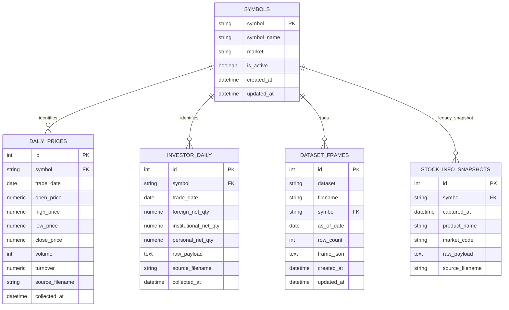

# invest_bot DB migration ERD

## Purpose

이 문서는 **현재 코드 기준 실제 테이블 관계를 간략히 보여주는 보조 문서**다. 세부 책임과 사용자 변경 경계는 [`db_schema.md`](./db_schema.md)를 canonical source로 본다.

## Current relational shape

## Ownership notes

- `symbols`는 canonical 종목 reference다.
- `daily_prices`, `investor_daily`는 정규화된 fact table이다.
- `dataset_frames`는 raw/derived snapshot store다.
- `stock_info_snapshots`는 현재 정책 기준 **deprecated candidate**다.

## Migration direction

- 사용자 종목 검색/조회 source는 `symbols`로 단일화한다.
- `dataset_frames.stock_info`는 canonical source에서 제외한다.
- `stock_info_snapshots`는 후속 migration에서 제거 후보로 다룬다.
