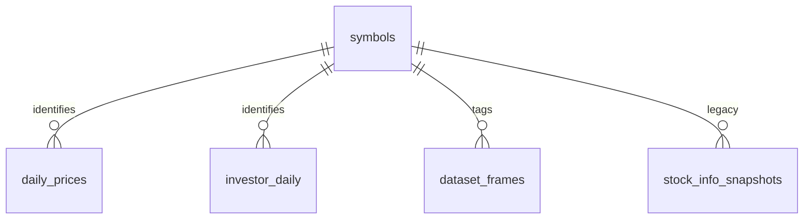

# invest_bot DB ERD operational summary

이 문서는 운영 관점에서 보는 간단한 ERD 요약이다. 세부 컬럼 정의와 write boundary는 [`../architecture/db_schema.md`](../architecture/db_schema.md)를 기준으로 본다.

## Operational interpretation

- `symbols`는 사용자 lookup의 canonical reference다.
- `daily_prices`, `investor_daily`는 수집 결과 fact table이다.
- `dataset_frames`는 preview/artifact/snapshot 저장소다.
- `stock_info_snapshots`는 deprecated candidate다.

## Write boundary

- 사용자 조회: write 없음
- 수집 실행: `daily_prices`, `investor_daily`, raw snapshot dataset만 write 가능
- 분석/리포트 실행: processed `dataset_frames`만 write 가능
- canonical reference(`symbols`): 종목 마스터 sync만 write 가능
