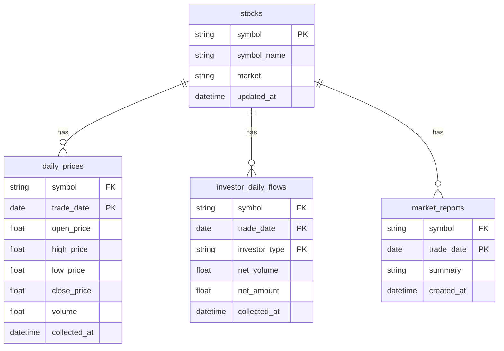

# invest_bot DB ERD Draft

This ERD finalizes the first-pass relational target for the current CSV datasets so the team can implement the migration behind stable repository contracts.

## Source mapping

- `stocks` ← `data/reference/stock_master.csv` plus `data/raw/domestic_stock/stock_info/*.csv`
- `daily_prices` ← `data/raw/domestic_stock/daily_prices/*.csv`
- `investor_daily_flows` ← `data/raw/domestic_stock/investor_daily/*.csv`
- `market_reports` ← `data/processed/domestic_stock/market_reports/*.md|*.txt`

## Explicitly deferred

- dashboard cache tables
- indicator/output tables for every derived artifact
- execution/order/trade ledgers
- real Alembic revision history and ORM models
