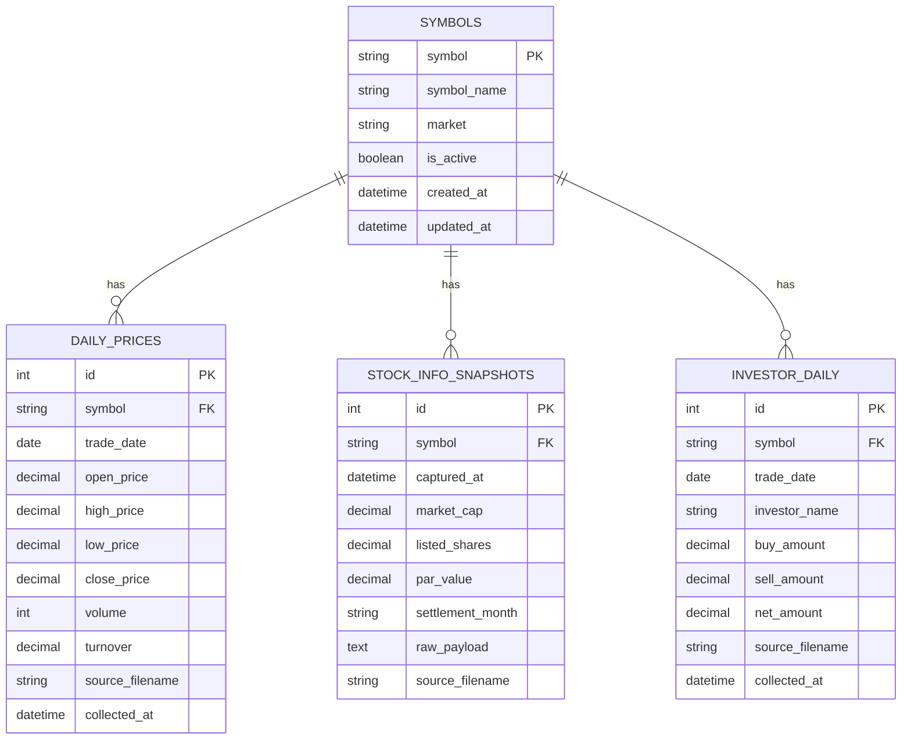

# invest_bot DB migration plan

## Scope

This draft turns the repository into a migration-ready state without changing the current CSV-based runtime. It finalizes four handoff artifacts:

1. Postgres/Alembic compose wiring
2. A concrete ERD for the first relational slice
3. Repository interfaces that let services depend on persistence contracts instead of CSV-only implementations
4. An implementation-ready rollout plan for later CSV -> DB cutover work

## Current state

- Runtime flows still write/read CSV files under `data/raw` and `data/processed`
- `docker-compose.yml` already provisions Postgres and a `migrate` service
- Before this draft, the repo had no Alembic config, migration script, or DB metadata/models to support that compose flow

## Finalized ERD

## Repository contract draft

`src/invest_bot/market/repositories.py` defines the migration seam:

- `DatasetStorage`: save datasets and expose a root directory
- `SymbolMasterRepository`: load/update symbol master entries

Current CSV classes already satisfy these contracts:

- `CsvStorage`
- `StockMasterRepository`

That lets later DB repositories land behind the same service constructor boundaries with smaller diffs.

## Docker Compose draft

`docker-compose.yml` now carries a canonical `DATABASE_URL` for every app container and the `migrate` container has real Alembic scaffolding to execute against.

Expected bootstrap sequence:

1. `db` becomes healthy
2. `migrate` runs `alembic upgrade head`
3. `scheduler` / `web` / `collector` wait for migration completion

## Rollout plan

### Phase 1 - done in this draft

- Add SQLAlchemy metadata/models for the initial relational slice
- Add Alembic config + initial migration
- Add repository interfaces so runtime services can depend on contracts
- Keep CSV runtime behavior unchanged

### Phase 2 - next implementation slice

- Add SQLAlchemy session/engine factory
- Implement Postgres repositories for symbol master and collected datasets
- Add CSV -> DB backfill command per dataset
- Add smoke test that boots Postgres and runs Alembic in CI

### Phase 3 - cutover

- Switch selected readers from CSV to repository-backed reads
- Add dual-write or one-time migration strategy for collectors
- Remove CSV-only assumptions from dashboard/report services where appropriate

## Risks / open follow-ups

- `investor_daily` uniqueness may need to widen if multiple investor rows per symbol/date are stored; validate with real payload shape before production cutover
- `stock_info_snapshots.raw_payload` is intentionally permissive until the stable column set is finalized
- Runtime services do not use the DB yet; this draft is migration scaffolding, not the cutover itself
