# invest_bot DB migration plan

이 문서는 현재 CSV 중심 `invest_bot`를 PostgreSQL + migration 기반 구조로 전환하기 위한 구현 준비 산출물이다. 범위는 다음 네 가지다.

1. ERD 초안 확정
2. `docker-compose.yml`의 DB/migration draft 정리
3. repository interface 경계 정의
4. 구현 순서와 위험요소를 담은 실행 계획 정리

## Current state summary

- 운영 데이터는 대부분 `CsvStorage`로 `data/raw`/`data/processed` 아래에 저장된다.
- 종목 마스터는 `StockMasterRepository`가 CSV 파일로 유지한다.
- 앱 설정은 `AppSettings`가 YAML 중심으로 읽고 있으며, 이번 작업에서 DB env contract를 함께 수용하도록 확장했다.
- `docker-compose.yml`은 PostgreSQL service를 포함하지만, 실제 Alembic/ORM 레이어는 아직 repo에 없다.

## Target persistence boundary

| Current file-backed component | New interface | Future DB implementation |
| --- | --- | --- |
| `CsvStorage` | `DatasetStorage` | SQLAlchemy/psycopg-backed dataset repository |
| `StockMasterRepository` | `StockMasterRepositoryProtocol` | stock master table reader/updater |
| file path reads in analyzers/generators | `DatasetStorage.root_dir` + `save()` contract | DB reader/query methods added in migration phase |

이번 단계의 목표는 DB를 즉시 도입하는 것이 아니라, **현재 기능을 깨지 않으면서 DB adapter를 끼워 넣을 수 있는 경계**를 먼저 만드는 것이다.

## ERD

```mermaid
erDiagram
    STOCK_MASTER ||--o{ STOCK_INFO_SNAPSHOT : enriches
    STOCK_MASTER ||--o{ DAILY_PRICE_BAR : identifies
    STOCK_MASTER ||--o{ INVESTOR_DAILY_FLOW : identifies
    STOCK_MASTER ||--o{ INDICATOR_SNAPSHOT : identifies
    STOCK_MASTER ||--o{ SIGNAL_EVENT : identifies
    STOCK_MASTER ||--o{ MARKET_REPORT_SNAPSHOT : identifies
    STOCK_MASTER ||--o{ BACKTEST_TRADE : identifies
    STOCK_MASTER ||--o{ BACKTEST_SUMMARY : identifies

    STOCK_MASTER {
        string symbol PK
        string symbol_name
        string market
        datetime updated_at
    }

    STOCK_INFO_SNAPSHOT {
        bigint id PK
        string symbol FK
        date as_of_date
        string product_name
        string market_code
        json raw_payload
        datetime collected_at
    }

    DAILY_PRICE_BAR {
        bigint id PK
        string symbol FK
        date trade_date
        numeric open
        numeric high
        numeric low
        numeric close
        bigint volume
        numeric turnover
        datetime collected_at
    }

    INVESTOR_DAILY_FLOW {
        bigint id PK
        string symbol FK
        date trade_date
        bigint foreign_net_qty
        bigint institutional_net_qty
        bigint personal_net_qty
        json raw_payload
        datetime collected_at
    }

    INDICATOR_SNAPSHOT {
        bigint id PK
        string symbol FK
        date trade_date
        numeric ma_5
        numeric ma_20
        numeric ma_60
        numeric volume_ma_5
        numeric rsi_14
        datetime calculated_at
    }

    SIGNAL_EVENT {
        bigint id PK
        string symbol FK
        date trade_date
        string strategy_name
        string signal
        string signal_reason
        numeric prev_ma_5
        numeric prev_ma_20
        numeric ma_5
        numeric ma_20
        datetime generated_at
    }

    MARKET_REPORT_SNAPSHOT {
        bigint id PK
        string symbol FK
        date report_date
        string trend_state
        string investor_flow
        string final_opinion
        text summary
        json payload
        datetime generated_at
    }

    BACKTEST_TRADE {
        bigint id PK
        string symbol FK
        date entry_signal_date
        date entry_date
        numeric entry_price
        date exit_signal_date
        date exit_date
        numeric exit_price
        numeric return_pct
        integer holding_days
        string exit_reason
    }

    BACKTEST_SUMMARY {
        bigint id PK
        string symbol FK
        integer source_rows
        integer buy_signal_count
        integer sell_signal_count
        integer trade_count
        numeric win_rate_pct
        numeric average_return_pct
        numeric total_return_pct
        numeric max_drawdown_pct
        numeric final_equity
        datetime generated_at
    }
```



## Docker Compose draft stance

`docker-compose.yml`은 이번 단계에서 다음 원칙으로 정리했다.

- `db` service는 기본으로 유지한다.
- `migrate` service는 실제 migration stack이 아직 없으므로 `migrations` profile 뒤로 숨긴다.
- `web`/`scheduler`/`collector`는 더 이상 `migrate` 성공을 하드 의존하지 않는다.
- `env_file`은 repo에 실제 존재하는 `.env.example`을 사용해 초안 실행 가능성을 높인다.

예상 실행 흐름:

```bash
docker compose up db web
```

향후 migration stack이 추가되면:

```bash
docker compose --profile migrations run --rm migrate
docker compose up db web scheduler
```

## Implementation plan

### Phase 1 — Boundary freeze

- [x] DB env contract를 `AppSettings`에 추가
- [x] `DatasetStorage`, `StockMasterRepositoryProtocol` 정의
- [x] 분석/리포트/시그널/백테스트/심볼 조회 코드가 concrete class 대신 interface를 받도록 조정
- [x] 기존 CSV adapter는 기본 구현으로 유지

### Phase 2 — Migration bootstrap

- [ ] `requirements.txt`에 DB driver/ORM/migration dependency 추가 (`SQLAlchemy`, `alembic`, `psycopg` 등)
- [ ] `alembic.ini` 및 migration environment 생성
- [ ] `src/invest_bot/db/` 아래 engine, session, ORM model 추가
- [ ] 첫 migration에서 `stock_master`, `stock_info_snapshots`, `daily_price_bars`, `investor_daily_flows` 생성

### Phase 3 — Dual-write / adapter migration

- [ ] file-backed repository와 DB-backed repository를 병행 가능하도록 구성
- [ ] collector/analyzer/report generator에 write target 선택 옵션 도입
- [ ] symbol lookup이 DB 우선 + file fallback 또는 반대 정책을 명시적으로 선택하도록 변경

### Phase 4 — Read path migration

- [ ] dashboard/report/backtest read path를 DB query 기반으로 전환
- [ ] CSV export는 secondary artifact로만 유지
- [ ] regression test를 fixture DB 기반으로 확대

## Risks and guardrails

1. **False-green compose risk**  
   migration 레이어가 없는데 `migrate`를 기본 의존으로 두면 웹/스케줄러가 시작조차 못 한다.

2. **Lookup regression risk**  
   `SymbolLookup`는 현재 로컬 `stock_info` CSV fallback에 의존하므로, DB 이전 시 fallback 제거를 서두르면 사용자 입력 해석이 깨질 수 있다.

3. **Shared-file integration risk**  
   `docker-compose.yml`, `requirements*.txt`, `AppSettings`는 다른 작업과 충돌 가능성이 높다. DB dependency 추가는 Phase 2에서 한 번에 묶는 편이 안전하다.

4. **Schema inflation risk**  
   CSV 산출물의 모든 컬럼을 초기에 정규화하려고 하면 migration 범위가 과도해진다. 핵심 엔티티 + raw payload 보관 전략으로 시작한다.

## Acceptance criteria for the next implementation pass

다음 작업자는 아래가 준비되면 실제 DB bootstrap에 들어갈 수 있다.

- `AppSettings.database_url`을 사용하는 DB engine bootstrap 코드 추가
- Alembic 초기 migration 생성
- `StockMasterRepositoryProtocol`의 DB 구현체 추가
- 최소 1개 write path를 DB-backed adapter로 대체
- compose `migrate` profile이 실제 성공하는 상태 검증
